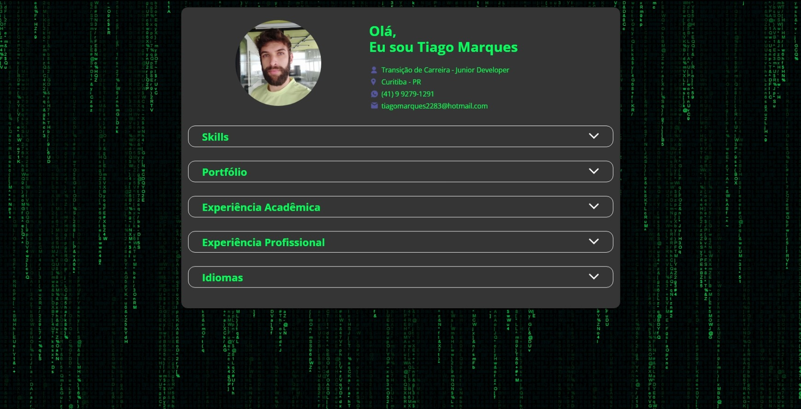

# Portfólio Dinâmico com JavaScript  

____  

### Descrição do Projeto  

Este projeto consiste na criação de uma página web para compartilhar informações pessoais e profissionais de forma dinâmica. A página exibe experiências profissionais, acadêmicas, idiomas e projetos no GitHub, organizados por seções, utilizando os dados fornecidos em um arquivo `profile.json`.  

A lógica do projeto foi desenvolvida em JavaScript para preencher automaticamente uma página HTML estruturada e estilizada com CSS. Isso permite que as informações sejam atualizadas facilmente editando apenas o arquivo JSON, sem necessidade de alterar o código-fonte da página diretamente.  

____  

### Funcionalidades  

- Exibição de dados profissionais, acadêmicos e pessoais de forma organizada.  
- Integração através de Links com projetos no GitHub.  
- Atualização dinâmica da página via **arquivo JSON**.  
- Estrutura responsiva e design estilizado em **CSS**.  
- Utilização de um **Background com efeito de movimento com o tema de Matrix** através do compartilhamento do código de um Usuário disponibilizado via CodePen fazendo algumas alterações no código para se adaptar a minha página!

____  

### Tecnologias Utilizadas  

- HTML: Estrutura da página.
- CSS: Estilização e design responsivo.
- JavaScript: Lógica para renderizar os dados do JSON dinamicamente.
____ 

### Prévia do Projeto

- Segue uma imagem de demonstração da página criada:

---

Feito com :heart: por Tiago Marques.
